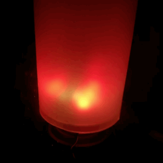

# bluetooth-speaker-led

This is the code for the bluetooth speaker with integrated cylindircal RGB lamp consisting of 139 WS2812 LEDs.

# Synopsis

This code was written for the Arduino Nano (ATMEGA 328p) and uses its analog input pin A4 to measure the audio signal of the bluetooth receiver chip DAC before it goes into the amplifier for the speaker. 
It then performs a frequency analysis (DHT - Discrete Hartley TransforM) and displays a nice colourful pattern that is in sync with the music. 